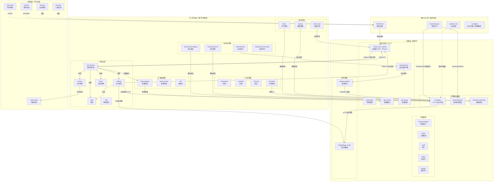

# Agentic Dev Kit

> 让 AI 写代码时像一个**守规矩的工程师**，而不是一个想到哪写到哪的实习生。

---

## 🤔 这东西是干嘛的？

想象你有一个**非常聪明但很鲁莽的同桌**帮你写作业：
- 他写得很快，但经常不审题就开始写
- 他不检查答案，写完就说「好了」
- 第二天换个座位，他就忘了昨天聊了啥

**这套工具就是给他立的「规矩」**——让他每次写之前先想清楚，写完以后先检查，换座位也记得昨天做到哪了。

| 没规矩的 AI | 有了这套规矩 |
|---|---|
| 直接开写，不问你要什么 ✏️ | 先问你：「你真正想要的是什么？」🤔 |
| 不写测试，全靠猜 🎲 | 先写测试，再写代码 ✅ |
| 改 bug 靠碰运气 🍀 | 先找原因，再动手修 🔍 |
| 第二天就忘了昨天做了啥 😵 | 每次自动保存进度，下次能接着干 📋 |
| 说「改好了」但没真正检查 🤥 | 必须运行测试看到结果才算数 📊 |
| 碰壁了就说「我搞不定」🙅 | 强制穷尽一切方案，不放弃 💪 |
| 什么事都要问你确认 😵‍💫 | 简单任务直接做，复杂任务才确认 🧠 |

---

## ⚡ 怎么开始用？（只要 30 秒）

```bash
# 第 1 步：把这两样东西复制到你的项目文件夹
cp AGENT.md /你的项目路径/
cp -r .agent /你的项目路径/

# 第 2 步：打开项目，跟 AI 说
/init
```

**搞定。** AI 会自动扫描你的项目，然后就可以用了。

---

## 🎮 最常用的命令（记住这 5 个就够了）

这些命令就像游戏里的技能键——你输入命令，AI 就按标准流程执行。

### ⭐ 第一梯队：日常必备

| 你输入 | AI 会做什么 | 打个比方 |
|---|---|---|
| `/new-feature` | 智能判断复杂度，自动选择轻量/标准/完整流程 | 写作文：简单题直接写，难题先审题再写 🧠 |
| `/debug` | 智能判断 Bug 复杂度，简单 Bug 直接修 | 医生看病：小感冒直接开药，疑难杂症才做全套检查 🏥 |
| `/review` | 检查代码质量 | 作文互改：同学 A 找问题 → B 反驳 → 老师裁判 |
| `/test` | 给代码写测试 | 出练习题：写几道题检验代码对不对 |
| `/tdd` | 先写测试再写代码 | 先出试卷再学知识，更有方向 |

### 💾 第二梯队：保存和恢复

AI 和你聊天是有「记忆上限」的，就像白板写满了就得擦掉重来。这 3 个命令帮你保存进度：

| 你输入 | AI 会做什么 | 打个比方 |
|---|---|---|
| `/checkpoint` | 保存当前进度 | 游戏里的**存档** 💾 |
| `/handoff` | 打包交接给下一次聊天 | 交接班时的**工作日志** 📝 |
| `/resume` | 从上次的存档恢复 | 游戏里的**读档** 🔄 |

> 💡 **推荐流程**：做完一段工作 → `/checkpoint` → 下次新聊天 → `/resume`

### 🚀 第三梯队：自动化高级功能

| 你输入 | AI 会做什么 | 打个比方 |
|---|---|---|
| `/autoresearch` | 自动优化（改一下 → 测一下 → 好了留着，不好就撤） | 自动刷题机，刷到满分为止 |
| `/autoresearch:security` | 安全检查 + 自动修复 | 请保安巡逻一圈，把门窗漏洞堵上 |
| `/autoresearch:fix` | 修复所有报错直到零 | 把试卷上所有红叉都改成绿勾 |
| `/autoresearch:debug` | 自动追踪 Bug 直到找到 | 侦探追凶，查到水落石出 |

### 🧠 第四梯队：让 AI 越用越聪明

| 你输入 | AI 会做什么 | 打个比方 |
|---|---|---|
| `/learn` | 记住这次聊天中学到的经验 | 做完练习写**错题本** 📒 |
| `/evolve` | 清理和升级积累的经验 | 期末复习时**整理笔记** 📚 |
| `/instinct` | 管理已经学到的经验 | 翻看和整理**错题本** |

### 🛡️ 第五梯队：维护和安全

| 你输入 | AI 会做什么 | 打个比方 |
|---|---|---|
| `/stress-test` | 检验规范是否还有效（打分，满分 100） | **期末考试** 📝 |
| `/config-scan` | 检查配置文件有没有安全问题 | **消防检查** 🧯 |
| `/harness-audit` | 检查整体配置健康度 | **年度体检** 🏥 |
| `/escalate` | 手动强制 AI 进入高压模式 | **教练拍桌子** 👊 |
| `/skill-create` | 从项目历史自动生成编码规范 | 新转学来，先翻翻以前的课堂笔记 |
| `/init` | 第一次用时初始化 | **开学第一天** 注册报到 |
| `/finish` | 完成功能收尾 | 交作业前最后检查一遍 |
| `/context-reset` | AI 思路乱了时重置 | 擦掉白板，重新来 |

### 📋 第六梯队：规格管理

| 你输入 | AI 会做什么 |
|---|---|
| `/spec:propose` | 用标准格式写一个变更提案 |
| `/spec:archive` | 把做完的变更归档 |

---

## 🧠 聪明干活（智能档位选择）

> 📦 **新增功能**

AI 不再对所有任务都走完整流程——它会**自动判断任务复杂度**，选择合适的档位：

| | 🟢 轻量模式 | 🟡 标准模式 | 🔴 完整模式 |
|---|---|---|---|
| **什么时候** | 改 1-2 个文件的小活 | 新增功能、重构模块 | 新系统、架构变更 |
| **问你几次** | **0 次**（做完汇报） | **1 次**（关键决策确认） | **2-3 次**（设计+契约+验收） |
| **打个比方** | 改错别字，老师直接改 | 写新段落，先对下思路 | 写论文，要审题列纲验收 |
| **跳过什么** | 跳设计、跳契约、直接做 | 简化设计、简化契约 | 什么都不跳 |

> 💡 **你不用管**——AI 会自己选档位。如果做到一半发现比预想复杂，会**自动升档**并告诉你。

---

## 🧩 AI 脑子里装了什么？（技能系统）

技能就像 AI 的**教科书**——遇到不同的题目，它会翻不同的书。

### 📕 核心教科书（AI 自动翻开）

| 技能名 | 教什么 | 什么时候用 |
|---|---|---|
| `world_class_coding` | 怎么规范地写代码 | **几乎所有时候**——这是最基础的教科书 |
| `code-graph` | 改一个地方会影响哪些地方 | 修改代码前做「影响分析」 |
| `spec-driven` | 怎么写需求文档 | 需要正式的需求规格时 |
| `autoresearch` | 怎么自动优化 | 执行 `/autoresearch` 系列命令时 |
| `doc-lookup` | 查资料的正确方法 | 调研阶段 |
| `frontend-design` | 怎么做好看的界面 | 做前端 UI 时 |
| `polish` | 上线前最后检查 | 代码写完、准备上线前 |
| `audit` | 无障碍/性能审查 | 专项审计时 |
| `adapt` | 让界面适配不同屏幕 | 需要适配手机/平板时 |
| `harden` | 处理异常和边界情况 | 代码需要更健壮时 |

### 📙 情境触发教科书（满足条件时自动翻开）

| 技能名 | 教什么 | 什么时候自动触发 |
|---|---|---|
| `escalation` | 失败时怎么逐步加压 | 📦 **新增** 连续失败 2+ 次时自动触发 |
| `hooks-lifecycle` | 自动保存/恢复状态 | 会话开始/结束/上下文压缩时 |
| `continuous-learning` | 怎么从经验中学习 | `/learn`/`/evolve`/`/handoff` 时 |

### 📘 按需教科书（用对应命令时才翻开）

| 技能名 | 教什么 | 什么命令触发 |
|---|---|---|
| `config-security` | 怎么检查配置安全 | `/config-scan` 时 |
| `skill-creator` | 怎么从历史提取规范 | `/skill-create` 时 |
| `methodology-router` | 换个思路解决问题 | 被 `escalation` 自动引用 |

### 📗 口袋教科书（你用自然语言就能触发）

不用背命令，直接说你要什么：

```
「给这个按钮加个动画    」     → AI 翻开 animate
「配色不好看」             → AI 翻开 colorize
「视觉冲击力不够」         → AI 翻开 bolder
「设计太复杂了」           → AI 翻开 distill
「帮我评估这个设计」       → AI 翻开 critique
「提取成组件」             → AI 翻开 extract
「加载太慢了」             → AI 翻开 optimize
...一共 12 个微调技能
```

---

## 🤖 AI 助手团队（专职 Agent）

> 📦 **新增功能**

除了「主 AI」，还有 5 个专职小助手，各管各的事：

| 助手名字 | 它负责啥 | 它能做什么 | 打个比方 |
|---|---|---|---|
| `planner` | 做计划 | 只能看代码，不能改 | **军师**——只出主意 |
| `reviewer` | 查代码 | 只能看代码，不能改 | **检查员**——只找问题 |
| `tester` | 写测试 | 能写测试文件，能跑命令 | **考官**——出题和批改 |
| `security-reviewer` | 安全检查 | 只能看代码，不能改 | **保安队长**——巡逻找漏洞 |
| `doc-updater` | 更新文档 | 只能改文档文件 | **秘书**——负责记录 |

> 🎯 **什么时候用？** 当 AI 需要同时做好几件事的时候（比如一边审查一边写文档），把不同的活分给不同的助手更快。

---

## 🧠 越用越聪明（持续学习系统）

> 📦 **新增功能**

AI 会从每次工作中**学习经验**，就像学生的错题本：

```
第 1 次发现一个编码习惯 → 记录下来（置信度 1 分）
第 2 次又碰到同样的事   → 标记为「候选规矩」（3 分）
第 5 次都验证有效       → 自动变成正式规矩！（5 分）✨
```

**你需要做的**：
1. 工作结束时输入 `/learn`（让 AI 记笔记）
2. 每 2-4 周输入 `/evolve`（让 AI 整理笔记，把好经验变成正式规矩）
3. 偶尔输入 `/instinct prune`（清理没用的旧笔记）

---

## 💾 自动存档（会话生命周期钩子）

> 📦 **新增功能**

就像游戏的**自动存档**——你可能忘了手动存档，但系统会帮你保底：

| 时机 | 自动做什么 | 脚本 |
|---|---|---|
| 每次开始新聊天 | 检查上次存档、git 状态、学习进度 | `session-start.sh` |
| 每次结束聊天 | 自动保存一份简单存档 | `session-end.sh` |

> ⚠️ 自动存档是**保底**，不能完全替代手动的 `/checkpoint`。就像游戏自动存档不能替代你在关键前主动存一次。

---

## 💪 失败不放弃（压力升级系统）

> 📦 **新增功能** — 灵感来源：[PUA](https://github.com/tanweai/pua)

普通 AI 碰壁就放弃，这套系统**不允许**：

```
第 1 次失败 → 没事，允许试错
第 2 次失败 → ⚡ L1：必须换个本质不同的方案（换参数不算！）
第 3 次失败 → 🔍 L2：搜索 + 读源码 + 列 3 个假设
第 4 次失败 → 📋 L3：完成七项检查清单（每项打勾）
第 5 次失败 → 🚨 L4：强制换方法论 + 拼命模式
```

**三条红线**（绝对不能违反）：
1. 🚫 **没有证据不能说「完成了」** — 必须跑命令 + 贴输出
2. 🚫 **没验证不能说「是 XX 的问题」** — 猜的不算
3. 🚫 **没穷尽一切不能说「搞不定」** — 七项清单做完了吗？

> 💡 如果觉得 AI 在摸鱼，输入 `/escalate` 手动把它拉到高压模式。

---

## 🗺️ 架构全景图（调用关系脑图）



**图例说明**：
- **实线箭头** `→` = 直接调用/加载
- **虚线箭头** `⇢` = 规则约束/触发关系
- **四层架构**：Agent 层（始终生效）→ 工作流层（命令触发）→ 技能层（教科书）→ 规则层（约束）

---

## 🔨 开发者工具（CLI & 自动化）

> 📦 **新增功能**

除了 AI 聊天命令，还提供了**可直接在终端运行**的开发者工具：

### CLI 工具

```bash
# 初始化新项目
bin/agentic init ./my-project

# 验证框架结构完整性（17 项检查）
bin/agentic validate

# 运行健康检查（指令膨胀检测）
bin/agentic health

# 量化评分（5 维度，满分 100）
bin/agentic stress-test
```

### Makefile 快捷命令

| 命令 | 做什么 | 打个比方 |
|---|---|---|
| `make test` | 运行全量自动化测试（4 套件，20+ 断言） | 期末考试 📝 |
| `make validate` | 检查框架结构完整性（17 项） | 消防检查 🧯 |
| `make health` | 检测指令文件膨胀 | 体重秤 ⚖️ |
| `make stress-test` | 量化评分（A/B/C/D/F） | 体检报告 🏥 |
| `make lint` | 脚本语法检查 | 拼写检查 ✏️ |

### 压力升级状态机

> 将 Markdown 里的 L1-L4 规则变成了**可执行程序**：

```bash
# 记录一次失败（自动升级压力等级）
bash .agent/scripts/escalation-tracker.sh fail

# 查看当前等级
bash .agent/scripts/escalation-tracker.sh status

# 成功后重置
bash .agent/scripts/escalation-tracker.sh reset
```

---

## 📁 文件一览

```
你的项目/
├── AGENT.md                   ← AI 的「课程表」（告诉它什么时候翻什么教科书）
├── AGENT.local.md             ← 你的个人设置（不会上传到 git）
├── Makefile                   ← 一键命令入口（make test / validate / health）
├── bin/
│   └── agentic                ← CLI 工具（init / validate / health / stress-test）
├── tests/                     ← 🧪 自动化测试（4 套件，20+ 断言）
│   ├── test-all.sh            ← 测试 Runner
│   ├── test-scripts-syntax.sh ← 脚本语法检查
│   ├── test-validate-structure.sh ← 结构验证器测试
│   ├── test-escalation-tracker.sh ← 状态机行为测试（11 cases）
│   └── test-health-check.sh   ← 健康检查测试
└── .agent/
    ├── skills/                ← 📕 教科书（28 本，含 escalation 新增）
    ├── workflows/             ← 📋 标准流程（22 个，含 /escalate 新增）
    ├── agents/                ← 🤖 专职助手（5 个）
    ├── rules/                 ← 📏 规矩（编码风格、测试、安全、红线等）
    ├── scripts/               ← ⚙️ 自动化脚本（7 个，含验证器和状态机）
    │   ├── validate-structure.sh   ← 框架结构验证器（7 类 17 项检查）
    │   ├── escalation-tracker.sh   ← 压力升级状态机（L0-L4）
    │   ├── stress-test-engine.sh   ← 量化评分引擎（5 维度 100 分制）
    │   ├── health-check.sh         ← 指令膨胀检测
    │   ├── session-start.sh        ← 会话启动检查
    │   ├── session-end.sh          ← 会话结束自动保存
    │   └── setup-graph.sh          ← 代码图谱初始化
    └── instincts/             ← 🧠 经验笔记（AI 学到的东西）
```

---

## 🔧 怎么自定义？

### 给项目加自己的规矩

在 `AGENT.md` 最后加：

```markdown
## 项目规则
- 本项目用 Python 3.12
- 所有接口必须有文档
```

### 给自己加偏好（不影响团队）

创建一个 `AGENT.local.md`，写你自己的偏好就行。这个文件不会上传到 git，只有你自己能看到。

### 大项目怎么办？

```
大项目/
├── AGENT.md          ← 全公司的规矩
├── 前端代码/
│   └── AGENT.md      ← 前端专用的规矩（覆盖全公司的）
└── 后端代码/
    └── AGENT.md      ← 后端专用的规矩（覆盖全公司的）
```

---

## 🔄 日常维护清单

| 什么时候 | 做什么 | 输入什么 |
|---|---|---|
| 每次聊完天 | 让 AI 记笔记 | `/learn` |
| 每 2-4 周 | 让 AI 整理笔记、清理旧规矩 | `/evolve` |
| 每个月 | 考试看看规矩还有没有效 | `make stress-test` 或 `/stress-test` |
| 偶尔 | 检查配置安全 | `/config-scan` |
| 偶尔 | 检查框架结构 | `make validate` |
| 提交代码前 | 跑一遍自动化测试 | `make test` |
| AI 脑子乱了 | 重置 | `/context-reset` |
| 新项目 | 初始化 + 从历史学习 | `bin/agentic init` + `/skill-create` |

---

## ⚙️ 在哪里能用？

| 环境 | 能用吗 |
|---|---|
| **Antigravity IDE** | ✅ 能用，在聊天框输入 `/命令` |
| **Gemini CLI** | ✅ 能用，在终端输入 `/命令` |

把文件复制过去就行，**不需要装任何东西**。

---

## 📚 这套工具参考了

- [How To Be A World-Class Agentic Engineer](https://github.com/spidersea/agentic) — 核心方法论
- [everything-claude-code](https://github.com/affaan-m/everything-claude-code) — 持续学习、自动存档、安全扫描
- [OpenSpec](https://github.com/Fission-AI/OpenSpec/) — 规格驱动开发
- [code-review-graph](https://github.com/tirth8205/code-review-graph) — 代码知识图谱
- [gstack](https://github.com/garrytan/gstack) — Boil the Lake 哲学
- [superpowers](https://github.com/obra/superpowers) — 计划可执行性标准
- [PUA](https://github.com/tanweai/pua) — 压力升级、方法论路由、三条红线
